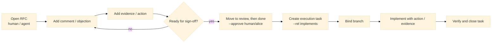

# git-forum

> Git-native RFCs, issues, decisions, tasks, and structured human-agent coding discussion.

`git-forum` is a CLI for running design and implementation work in Git. A repository's threads
live as append-only event chains under `refs/forum/*`. Each thread carries a `lifecycle` facet
(`proposal` / `execution` / `record`) and free-form `tags` — together they replace the four 1.x
thread kinds while preserving the everyday CLI surface (`new rfc`, `new task`, `new bug`,
`new dec`).

Discussion is recorded as four canonical typed nodes — `comment`, `approval`, `objection`,
`action` — chosen by **protocol effect** rather than rhetorical move. The goal is not to manage
AI provenance; the goal is to give humans and coding agents the same work protocol.



The core idea of `git-forum` is to keep goals, constraints, implementation work, and review in one
Git-native history: branchable, reviewable, and preserved in the same repository as the code.

## What it feels like

```bash
$ git forum init
$ git forum new rfc "Switch solver backend to trait objects" \
  --body "Goal, constraints, acceptance."
created thread @a7f3b2x1
  lifecycle:  proposal
  tags:       cross-cutting
  status:     draft

$ git forum comment @a7f3 "Need a stable plugin-facing boundary."
$ git forum comment @a7f3 "Q: what compatibility risks remain?" --as ai/reviewer
$ git forum comment @a7f3 \
  "Direction is plausible, but migration evidence is still missing."

$ git forum propose @a7f3                          # draft -> open
$ git forum state @a7f3 review                     # open  -> review
$ git forum accept @a7f3 --approve human/alice     # review -> done

$ git forum new task "Implement trait backend" \
  --link-to @a7f3 --rel implements
created thread @m2k9p4n8
  lifecycle:  execution
  tags:       task

$ git forum branch bind @m2k9 feat/trait-backend
$ git forum evidence add @m2k9 --kind test --ref tests/backend_trait.rs
$ git forum close @m2k9 --comment "All tests passing."
```

The `@` prefix is shell-safe and display-only — every CLI position also accepts the bare token
(`a7f3b2x1`). Legacy 1.x IDs (`RFC-…`, `ASK-…`, etc.) keep resolving via the alias table after
`git forum migrate`.

## Install

At the moment, installation is source-build first.

Requirements:

- Rust stable
- Git

```bash
cargo install --path .
git-forum --help
```

If you only want to try it during development:

```bash
cargo run -- --help
```

To print the manual in one shot, including for LLM/tool consumption:

```bash
git-forum --help-llm
```

## Why

Typical issue trackers and code-hosting tools still leave a few gaps:

- problem framing and implementation tasks drift apart
- comment streams do not distinguish question, objection, summary, and action
- humans and coding agents often end up using different work interfaces
- branch-local work is hard to connect back to the design discussion

`git-forum` aims to handle that workflow in a Git-native way.

## What Makes git-forum Different

### RFC-first project starts

New work usually starts as an `rfc`, not a bug or task. An RFC that reaches `done` is the
decision record for that direction. There is no separate `decision` workflow — recording a
local design choice is what `lifecycle=record` (`new dec`) is for.

### Structured discussion, not just comments

Discussion is modeled as four typed nodes chosen by protocol effect:

- `comment` — body-prose contribution (questions, summaries, observations, risks).
- `approval` — counts toward state-transition guards (e.g. `one_human_approval`).
- `objection` — blocks state transitions until resolved.
- `action` — a tracked obligation that must be resolved before terminal states.

`evidence` is a separate first-class concept attached via `evidence add`.

### Human and agent use the same protocol

There is no separate AI command set. Humans and agents use the same thread model, the same node
types, the same state transitions, and the same `--as <actor>` flag.

### Branch-bound implementation work

Execution threads (tasks and bugs) are where implementation happens. They can link back to
RFCs and bind to Git branches, so design and code stay connected.

### Git-native evidence and links

Threads can point to commits, files, tests, benchmarks, and other threads, and all of that lives
in Git history.

### Distribution is plain Git

Forum data lives in `refs/forum/*`. Replicate it with standard `git push` / `git fetch` on
those refs. `git-forum` does not introduce its own push / fetch protocol or cross-clone
conflict resolution — non-fast-forward divergence is reconciled with the same Git tooling used
for branches.

## Core model

- **thread**: append-only event chain with a `lifecycle` facet (`proposal` / `execution` /
  `record`) and free-form `tags`. The four 1.x kinds map to (lifecycle, tags) pairs and
  remain as stable CLI presets (`new rfc`, `new dec`, `new task`, `new issue` / `new bug`).
- **event**: append-only record for creation, discussion, state transitions, links, evidence,
  and facet changes (`facet_set`).
- **node**: four typed contributions — `comment`, `approval`, `objection`, `action`.
- **evidence**: links to commits, files, tests, benchmarks, docs, threads, and external URLs.
- **actor**: a human or AI participant identified by a trust-based actor ID (e.g.
  `human/alice`, `ai/reviewer`).

The authoritative product specification is in [./doc/spec/SPEC-2.0.md](./doc/spec/SPEC-2.0.md);
[./doc/spec/SPEC.md](./doc/spec/SPEC.md) is the inherited 1.x spec, kept for sections SPEC-2.0
references unchanged.
For current CLI usage, see [./doc/MANUAL.md](./doc/MANUAL.md).
For in-progress and planned work, see [./doc/ROADMAP.md](./doc/ROADMAP.md).

## Repository layout

Authoritative data lives in Git refs, while shared rules and templates live in the working tree.

```text
.forum/
  policy.toml
  actors.toml
  templates/
    thread.md            # generic
    proposal.md          # lifecycle=proposal
    execution.md         # lifecycle=execution
    record.md            # lifecycle=record

<git-dir>/forum/         # <git-dir> = .git/ or worktree git dir
  index.db
  local.toml             # per-clone settings (commit identity, default actor)

refs/forum/threads/*     # one ref per thread, bare 8-char base36 token
```

`local.toml` is optional. It supports a `[commit_identity]` section to override the Git
author/committer on forum commits (useful for privacy when pushing refs to shared remotes).
See [doc/MANUAL.md](./doc/MANUAL.md#local-configuration) for details.

## Status

`git-forum` is functional and under active development. The following capabilities are implemented:

- Threads with `lifecycle` (`proposal` / `execution` / `record`) and free-form `tags`; preset
  shortcuts `new rfc/dec/task/issue/bug` produce the four conventional (lifecycle, tags) pairs
- Unified state machine — `draft`, `open`, `working`, `review`, `done`, `rejected`,
  `withdrawn`, `deprecated` — gated per-lifecycle (proposals skip `working`; records skip
  `working` and `review`)
- Opaque content-addressed thread IDs (`@XXXXXXXX`, base36 token) for conflict-free
  distributed allocation; legacy `RFC-…` / `ASK-…` / `DEC-…` / `JOB-…` IDs resolve via the
  alias table after `migrate`
- Append-only event log stored as Git commits
- Four canonical discussion nodes (`comment`, `approval`, `objection`, `action`) with
  shorthand commands; legacy 1.x types (`claim`, `question`, `summary`, `risk`, `review`,
  `alternative`, `assumption`) alias to `comment` for one minor release with a deprecation
  warning
- Policy-driven state transitions with **lifecycle / tag-scoped** guards (e.g.
  `lifecycle=proposal AND tag=cross-cutting : review->done`) and operation checks
- State transition shorthands: `close`, `pend`, `accept`, `propose`, `reject`, `withdraw`,
  `deprecate` — each lifecycle-aware
- Combined state change + comment + link + approval in one command (`--comment`,
  `--link-to`, `--approve`)
- Evidence attachment (commits, files, tests, benchmarks, external URLs) with bulk `--ref`
  support
- Thread-to-thread links; advisory one-hop incoming-`implements` view via
  `git forum show <ID> --tree`
- Read-only single-thread digest for agents and scripts: `git forum brief <ID> [--json]`
- Retroactive thread creation from commits (`--from-commit`) or existing threads
  (`--from-thread`)
- Branch binding for execution threads
- Lexical search over a SQLite index (with evidence dedup index for fast import lookups);
  legacy `kind:rfc`-style queries auto-translate to `lifecycle:proposal AND tag:cross-cutting`
- GitHub issue import/export via `gh` CLI (`import github-issue`, `export github-issue`)
- TUI with list, detail, create, sort, filter, mouse support, color coding (by lifecycle and
  status), markdown rendering, full-screen select mode, incremental refresh, and performance
  telemetry. The thread-create form takes `lifecycle` + comma-separated `tags`.
- Reply chains, node revision history, thread body revision with `--incorporates`, body
  revision diff
- `--edit` flag to open `$EDITOR` for interactive body composition
- Operation checks: creation rules (per-lifecycle, with optional `tag.<name>` specialization),
  node rules, revise rules, evidence rules with error/warning severity model, `--force`
  bypass, and strict mode
- Concurrency safety via atomic ref updates within a clone; cross-clone replication is plain
  `git push` / `git fetch` on `refs/forum/*` (no separate `git forum push` / `git forum fetch`
  protocol — see SPEC-2.0 §8.2)
- Git worktree support
- Git hooks auto-installed on init: commit-msg (validates thread ID references) and
  post-checkout (worktree auto-init, index blob repair)
- Health checks via `doctor` (refs, templates, index integrity, index blobs, fetch refspec);
  cross-thread observations surface as informational advisories only
- Auto-configure forum fetch refspec on `init` for seamless clone workflows
- One-shot 1.x → 2.0 migration via `git forum migrate` (rewrites refs to bare-token form,
  emits `facet_set` events, remaps states, preserves links, rewrites legacy node types to
  `comment` with `legacy_subtype`)

See [doc/ROADMAP.md](./doc/ROADMAP.md) for in-progress and planned work.

## Data retention and privacy

git-forum stores all discussion history as Git commits. When you push forum refs
(`refs/forum/*`) to a remote or distribute a repository, the following data travels with it:

| Data | Where stored | Removable? |
|------|-------------|------------|
| Thread titles and bodies | `event.json` in git commits | Yes, via `git forum purge` |
| Node bodies (comments, objections, etc.) | `event.json` in git commits | Yes, via `git forum purge` |
| Actor IDs (e.g., `human/alice`) | `event.json` in git commits | Yes, via `git forum purge --actor` |
| Git commit author name and email | Git commit metadata | Configurable via `[commit_identity]` in `local.toml` |
| Timestamps | `event.json` + git commit metadata | Not removable |
| Thread IDs and state transitions | `event.json` in git commits | Not removable |
| Retracted node content | Earlier git commits in chain | Yes, via `git forum purge` |
| Revised body history | Earlier git commits in chain | Yes, via `git forum purge` |

Key points:

- **Retract is soft-delete.** `git forum retract` marks a node inactive but the original body
  remains in git history. Use `git forum purge` for hard-delete.
- **Commit identity is configurable.** By default, forum commits use your `git config user.name`
  and `user.email`. Override this per-clone via `[commit_identity]` in `.git/forum/local.toml`.
- **Purge rewrites history.** `git forum purge` replaces content with `[purged]` by rewriting
  git commits. After purging, all clones must re-fetch and `git gc` should be run to remove
  unreachable objects.
- **Actor IDs may contain real names.** The default actor ID is derived from `git config
  user.name` (e.g., `human/taiki-mineno`). Set `GIT_FORUM_ACTOR` or `default_actor` in
  `local.toml` for privacy.
- **Actor IDs and approvals are recorded, not authenticated.** `--as` and `--approve` preserve
  the supplied IDs for attribution and workflow policy. Cryptographic verification is future work.

See [doc/MANUAL.md](./doc/MANUAL.md) for configuration details.

## License

MIT — see [LICENSE](./LICENSE).

## Contributing

TBD
