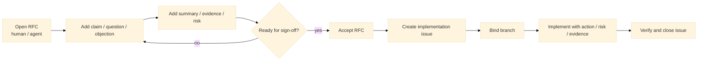

# git-forum

> Git-native RFCs, issues, and structured human-agent coding discussion.

`git-forum` is a CLI for running design and implementation work in Git with two first-class
objects: `rfc` and `issue`.

It records discussion as typed nodes such as `claim`, `question`, `objection`, `summary`,
`action`, and `risk`, instead of a plain comment stream. The goal is not to manage AI provenance.
The goal is to give humans and coding agents the same work protocol.



The core idea of `git-forum` is to keep goals, constraints, implementation work, and review in one
Git-native history: branchable, reviewable, and preserved in the same repository as the code.

## What it feels like

```bash
$ git forum init
$ git forum rfc new "Switch solver backend to trait objects" \
  --body "Goal, constraints, acceptance."
$ git forum claim RFC-0001 "Need a stable plugin-facing boundary."
$ git forum question RFC-0001 "What compatibility risks remain?" \
  --as ai/reviewer
$ git forum summary RFC-0001 \
  "Direction is plausible, but migration evidence is still missing."
$ git forum state RFC-0001 proposed
$ git forum state RFC-0001 under-review
$ git forum state RFC-0001 accepted --sign human/alice
$ git forum issue new "Implement trait backend" \
  --link-to RFC-0001 --rel implements
$ git forum branch bind ISSUE-0001 feat/trait-backend
$ git forum evidence add ISSUE-0001 --kind test --ref tests/backend_trait.rs
$ git forum state ISSUE-0001 closed
```

## Install

At the moment, installation is source-build first.

Requirements:

- Rust stable
- Git

```bash
cargo install --path .
git-forum --help
```

If you only want to try it during development:

```bash
cargo run -- --help
```

To print the manual in one shot, including for LLM/tool consumption:

```bash
git-forum --help-llm
```

## Why

Typical issue trackers and code-hosting tools still leave a few gaps:

- problem framing and implementation tasks drift apart
- comment streams do not distinguish question, objection, summary, and action
- humans and coding agents often end up using different work interfaces
- branch-local work is hard to connect back to the design discussion

`git-forum` aims to handle that workflow in a Git-native way.

## What Makes git-forum Different

### RFC-first project starts

New work usually starts as an `rfc`, not an `issue`. An accepted RFC is the decision record. There
is no separate `decision` object in the target model.

### Structured discussion, not just comments

Discussion is modeled as typed nodes such as `claim`, `question`, `objection`, `summary`,
`action`, and `risk`.

### Human and agent use the same protocol

The preferred workflow does not require a separate AI command set. Humans and agents should be able
to use the same thread model, the same node types, and the same state transitions.

### Branch-bound implementation work

Issues are where implementation happens. They can link back to RFCs and bind to Git branches, so
design and code stay connected.

### Git-native evidence and links

Threads can point to commits, files, tests, benchmarks, and other threads, and all of that lives in
Git history.

## Core model

- thread: shared abstraction for `issue` and `rfc`
- event: append-only record for creation, discussion, state transitions, links, and verification
- node: typed contribution such as `claim`, `question`, or `summary`
- evidence: links to commits, files, tests, benchmarks, docs, and threads
- actor: a human or AI participant

The detailed target model and MVP boundary are defined in [./doc/spec/MVP_SPEC.md](./doc/spec/MVP_SPEC.md).
For current CLI usage, see [./doc/MANUAL.md](./doc/MANUAL.md).

## Repository layout

Authoritative data lives in Git refs, while shared rules and templates live in the working tree.

```text
.forum/
  policy.toml
  actors.toml
  templates/
    issue.md
    rfc.md

.git/forum/
  index.sqlite
  local.toml

refs/forum/threads/*
refs/forum/index/*
```

## Status

`git-forum` is currently in the MVP stage. The target MVP is focused on:

- two core objects: `issue` and `rfc`
- append-only event log
- typed discussion nodes
- policy-driven state transitions
- evidence links and thread links
- branch binding for implementation issues
- local search and display
- a simple TUI
- minimal GitHub / GitLab import and export

Note:
The implementation now follows the preferred `rfc` + `issue` workflow described here.

## Non-goals for the MVP

The following are intentionally out of scope:

- heavy Web UI
- central SaaS server
- mandatory AI provenance tracking
- separate high-level agent-only command sets
- large Jira-style workflow management
- PM features such as story points or burndown
- advanced access control
- fully autonomous patch application
- complex recommendation systems built around embeddings

## Roadmap

### MVP

A minimal local-first setup with CLI and a simple TUI for RFC-first human-agent coding.

### v0.2

Better semantic merge, import/export, improved search, and more TUI polish.

### v0.3

Richer TUI support, stronger policy features, and better branch-aware workflows.

## License

TBD

## Contributing

TBD
