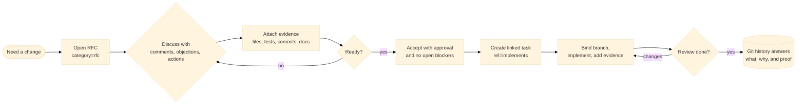

# git-forum

Git-native repository discussion for humans and AI coding agents.

`git-forum` keeps design intent, decisions, tasks, review, and evidence in the
same Git repository as the code. In 3.0, each thread is a snapshot ref under
`refs/forum/threads/<id>`; each change creates a normal Git commit on that ref.
Current state is read directly from the snapshot, and history is ordinary
`git log` / `git diff`.

## Workflow



> The highest-value path is: discuss direction in an RFC, accept it, link
> execution tasks with `rel=implements`, bind the branch, attach evidence, and
> close only when objections and actions are resolved.

## Quick Start

```bash
git forum init

git forum new rfc "Adopt snapshot-backed review" \
  --body "Goal, constraints, acceptance criteria."

git forum propose @a7f3b2x1
git forum comment @a7f3b2x1 "Need compatibility evidence before acceptance."
git forum objection @a7f3b2x1 "Migration dry-run output is not specified."
git forum action @a7f3b2x1 "Document migration dry-run output."
git forum evidence add @a7f3b2x1 --kind doc --ref doc/spec/SPEC-3.0-draft.md
git forum resolve @a7f3b2x1 n4k9v2mx
git forum accept @a7f3b2x1 --approve human/alice

git forum new task "Implement snapshot migration dry-run" \
  --link-to @a7f3b2x1 --rel implements
git forum branch bind @m2k9p4n8 feat/snapshot-migration
git forum evidence add @m2k9p4n8 --kind test --ref tests/migrate_v3_smoke_test.rs
git forum close @m2k9p4n8 --comment "Implemented and tested."
```

Every command position accepts the bare ID too, for example `a7f3b2x1`.

## Data Model

- **Thread**: one focused unit of repository discussion. Built-in categories are
  `rfc` for proposal review and `task` for execution work. Presets such as
  `new rfc`, `new dec`, `new task`, and `new bug` map to categories and tags.
- **Node**: one discussion contribution. The canonical node kinds are
  `comment`, `approval`, `objection`, and `action`, chosen by protocol effect.
- **Evidence**: links to commits, files, hunks, tests, benchmarks, docs, other
  threads, or external references.
- **Link**: a relationship between threads. `rel=implements` connects accepted
  direction to concrete execution.
- **Policy**: category-scoped state transitions and guards, stored in
  `.forum/policy.toml`.

## Storage

Authoritative thread state lives outside the working tree:

```text
refs/forum/threads/<id>    # snapshot commit
```

The snapshot tree contains:

```text
thread.toml
body.md
nodes/<node-id>.toml
nodes/<node-id>.md
links.toml
evidence.toml
legacy/events.ndjson      # migration archive, when present
```

Tracked repository configuration lives in `.forum/`; clone-local state lives in
`.git/forum/`. Forum refs are transported with normal Git fetch and push.

## Install

Requirements:

- Rust stable
- Git

```bash
cargo install --path .
git forum --help
```

For development:

```bash
cargo run -- --help
cargo run -- --help-llm
```

## Migration

Repos created with 1.x or 2.x event-chain storage must be migrated once:

```bash
git forum migrate --to 3.0 --dry-run
git forum migrate --to 3.0
```

Migration preserves useful user-facing content and links, projects the thread
into a 3.0 snapshot, and keeps the old event commits reachable in Git history.
Native 3.0 commands do not replay legacy event chains.

## Privacy

Forum content is Git content. Pushing `refs/forum/*` shares thread bodies, node
bodies, actor IDs, timestamps, links, and evidence. Use clone-local
`.git/forum/local.toml` for default actor and commit identity overrides, and do
not put secrets or private data in forum bodies.

## Docs

- [Manual](./doc/MANUAL.md)
- [3.0 spec draft](./doc/spec/SPEC-3.0-draft.md)
- [Core value](./doc/spec/CORE-VALUE.md)

## License

MIT. See [LICENSE](./LICENSE).
