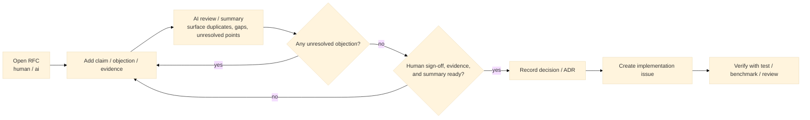

# git-forum

> Git-native RFCs, decisions, and auditable AI discussions.

`git-forum` is a CLI for managing issues, RFCs, and decisions in Git.
It records human and AI discussion as structured artifacts such as `claim`, `objection`, `evidence`, `summary`, and `decision`, instead of a plain comment stream.



The core idea of `git-forum` is to keep design discussion, decisions, evidence, and AI work history in one place: branchable, reviewable, and preserved in Git history.

## What it feels like

```bash
$ git forum init
$ git forum rfc new "Switch solver backend to trait objects" \
  --body "Needed to make plugin ABI stability explicit."
$ git forum say RFC-0012 --type claim \
  --body "Needed for plugin ABI stability."
$ git forum node show a1b2c3d4
$ git forum run spawn RFC-0012 --as ai/reviewer
$ git forum evidence add RFC-0012 \
  --kind benchmark --ref bench/solver.csv --rows 15:38
$ git forum state RFC-0012 accepted --sign human/alice
$ git forum issue new "Implement trait backend" --from RFC-0012
```

## Install

At the moment, installation is source-build first.

Requirements:

- Rust stable
- Git

```bash
cargo install --path .
git-forum --help
```

If you just want to try it during development, you can run it directly without installing:

```bash
cargo run -- --help
```

To print the full CLI manual in one shot, including for LLM/tool consumption:

```bash
git-forum --help-llm
```

## Why

Typical issue trackers and code-hosting AI tools still leave a few gaps:

- issues, RFCs, and decisions are managed separately
- discussion, conclusions, and evidence are weakly connected
- it is hard to audit what an AI saw, why it acted, and what it produced
- branch-local discussion is hard to merge semantically later

`git-forum` aims to handle that workflow in a Git-native way.

## What makes git-forum different

### Structured discussion, not just comments

Discussion is modeled as typed nodes such as `claim`, `question`, `objection`, `alternative`, `evidence`, `summary`, `decision`, and `action`.

### Auditable AI participation

AI output and state changes carry provenance, so you can track which actor used which model, with which context and tool calls.

### RFC and decision as first-class objects

It treats `rfc` and `decision` as first-class objects, not just `issue`.

### Branch-aware deliberation

Discussion can branch with code and be merged later.

## Core model

- thread: shared abstraction for `issue`, `rfc`, and `decision`
- event: append-only record for creation, discussion, state transitions, and verification
- evidence: links to commits, files, tests, benchmarks, docs, and threads
- actor: a human or AI participant
- run: one AI execution unit

The detailed data model and MVP boundary are defined in [./doc/spec/MVP_SPEC.md](./doc/spec/MVP_SPEC.md). For CLI usage, see [./doc/MANUAL.md](./doc/MANUAL.md).

## Repository layout

Authoritative data lives in Git refs, while repository-shared rules and templates live in the working tree.

```text
.forum/
  policy.toml
  actors.toml
  templates/
    issue.md
    rfc.md
    decision.md

.git/forum/
  index.sqlite
  local.toml

refs/forum/threads/*
refs/forum/runs/*
refs/forum/actors/*
refs/forum/index/*
```

## Status

`git-forum` is currently in the MVP stage. The first implementation is focused on:

- the three core objects: `issue`, `rfc`, `decision`
- append-only event log
- typed discussion nodes
- AI run provenance
- policy-driven state transitions
- evidence links
- local search and display
- a simple TUI
- minimal GitHub / GitLab import and export

## Non-goals for the MVP

The following are intentionally out of scope for the MVP:

- heavy Web UI
- central SaaS server
- large Jira-style workflow management
- PM features such as story points or burndown
- advanced access control
- fully autonomous patch application
- complex recommendation systems built around embeddings

## Roadmap

### MVP

A minimal local-first setup with CLI and a simple TUI.

### v0.2

Better semantic merge, expanded GitHub/GitLab bridge support, and improved search performance.

### v0.3

Richer TUI support, stronger policy features, and expanded AI roles.

## License

TBD

## Contributing

TBD
