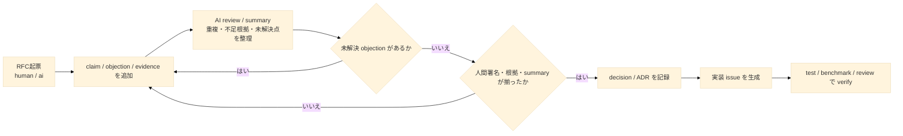

# git-forum

> Git-native RFCs, decisions, and auditable AI discussions.

`git-forum` は、issue・RFC・decision を Git 上で扱う CLI です。
人間と AI の議論をコメントの時系列ではなく、`claim`、`objection`、`evidence`、`summary`、`decision` として記録します。



設計議論、結論、根拠、AI の作業履歴が別々の場所に散らばらず、branch できて、レビューできて、Git 履歴として残る。それが `git-forum` の中心です。

## What it feels like

```bash
$ git forum init
$ git forum rfc new "Switch solver backend to trait objects"
$ git forum say RFC-0012 --type claim \
  --body "Needed for plugin ABI stability."
$ git forum run spawn RFC-0012 --as ai/reviewer
$ git forum evidence add RFC-0012 \
  --kind benchmark --ref bench/solver.csv --rows 15:38
$ git forum state RFC-0012 accepted --sign human/alice
$ git forum issue new "Implement trait backend" --from RFC-0012
```

## Why

通常の issue tracker とコードホスティングの AI には、まだ次の断絶があります。

- issue と RFC と decision が別々に管理される
- 議論と結論と根拠がつながりにくい
- AI が何を見て、何を根拠に、何をしたか追いにくい
- branch 上で進んだ議論を意味的に統合しにくい

`git-forum` は、これを Git-native に扱うことを目指します。

## What makes git-forum different

### Structured discussion, not just comments

発言を `claim`, `question`, `objection`, `alternative`, `evidence`, `summary`, `decision`, `action` といった型付きノードとして扱います。

### Auditable AI participation

AI の発言や状態変更には provenance を持たせます。どの actor が、どの model で、どの context を見て、どの tool を呼んだかを追跡できます。

### RFC and decision as first-class objects

`issue` だけでなく、`rfc` と `decision` を最初から同列に扱います。

### Branch-aware deliberation

議論はコードと同じく branch の上で分岐でき、後から統合できます。

## Core model

- thread: `issue`, `rfc`, `decision` の共通抽象
- event: 作成、発言、状態遷移、検証などを記録する append-only event
- evidence: commit、file、test、benchmark、doc、thread への根拠リンク
- actor: 人間と AI の参加主体
- run: AI の 1 回の実行単位

詳細なデータモデルと MVP の境界は [./docs/spec/MVP_SPEC.md](./docs/spec/MVP_SPEC.md) にあります。

## Repository layout

Authoritative data は Git refs に置き、repo で共有したいルールやテンプレートは working tree に置きます。

```text
.forum/
  policy.toml
  actors.toml
  templates/
    issue.md
    rfc.md
    decision.md

.git/forum/
  index.sqlite
  local.toml

refs/forum/threads/*
refs/forum/runs/*
refs/forum/actors/*
refs/forum/index/*
```

## Status

`git-forum` は現在、MVP 設計段階です。最初の実装は以下に集中します。

- `issue`, `rfc`, `decision` の 3 object
- append-only event log
- 型付き発言
- AI run provenance
- policy による状態遷移制御
- evidence link
- ローカル検索と表示
- 簡単な TUI
- GitHub / GitLab への最低限の import / export

## Non-goals for the MVP

MVP では、次は意図的にスコープ外に置きます。

- 重い Web UI
- SaaS 前提の中央サーバー
- Jira 風の巨大 workflow 管理
- story points / burndown などの PM 機能
- 高度な権限管理
- 自動 patch 適用の完全自律化
- embeddings 依存の複雑な推薦機能

## Roadmap

### MVP

ローカル CLI と簡単な TUI で完結する最小構成。

### v0.2

semantic merge の改善、GitHub / GitLab bridge の拡張、検索性能改善。

### v0.3

より豊かな TUI、policy、AI roles の拡張。

## License

TBD

## Contributing

TBD
