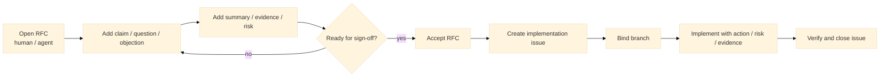

# git-forum

> Git-native RFCs, issues, decisions, tasks, and structured human-agent coding discussion.

`git-forum` is a CLI for running design and implementation work in Git with four thread kinds:
`rfc`, `issue`, `dec`, and `task`.

It records discussion as typed nodes such as `claim`, `question`, `objection`, `summary`,
`action`, `risk`, and `review`, instead of a plain comment stream. The goal is not to manage AI
provenance. The goal is to give humans and coding agents the same work protocol.



The core idea of `git-forum` is to keep goals, constraints, implementation work, and review in one
Git-native history: branchable, reviewable, and preserved in the same repository as the code.

## What it feels like

```bash
$ git forum init
$ git forum new rfc "Switch solver backend to trait objects" \
  --body "Goal, constraints, acceptance."
$ git forum node add RFC-0001 --type claim "Need a stable plugin-facing boundary."
$ git forum node add RFC-0001 --type question "What compatibility risks remain?" \
  --as ai/reviewer
$ git forum node add RFC-0001 --type summary \
  "Direction is plausible, but migration evidence is still missing."
$ git forum state RFC-0001 proposed
$ git forum state RFC-0001 under-review
$ git forum state RFC-0001 accepted --approve human/alice
$ git forum new issue "Implement trait backend" \
  --link-to RFC-0001 --rel implements
$ git forum branch bind ISSUE-0001 feat/trait-backend
$ git forum evidence add ISSUE-0001 --kind test --ref tests/backend_trait.rs
$ git forum state ISSUE-0001 closed --comment "All tests passing."
```

## Install

At the moment, installation is source-build first.

Requirements:

- Rust stable
- Git

```bash
cargo install --path .
git-forum --help
```

If you only want to try it during development:

```bash
cargo run -- --help
```

To print the manual in one shot, including for LLM/tool consumption:

```bash
git-forum --help-llm
```

## Why

Typical issue trackers and code-hosting tools still leave a few gaps:

- problem framing and implementation tasks drift apart
- comment streams do not distinguish question, objection, summary, and action
- humans and coding agents often end up using different work interfaces
- branch-local work is hard to connect back to the design discussion

`git-forum` aims to handle that workflow in a Git-native way.

## What Makes git-forum Different

### RFC-first project starts

New work usually starts as an `rfc`, not an `issue`. An accepted RFC is the decision record. There
is no separate `decision` object in the target model.

### Structured discussion, not just comments

Discussion is modeled as typed nodes such as `claim`, `question`, `objection`, `summary`,
`action`, `risk`, and `review`.

### Human and agent use the same protocol

The preferred workflow does not require a separate AI command set. Humans and agents should be able
to use the same thread model, the same node types, and the same state transitions.

### Branch-bound implementation work

Issues are where implementation happens. They can link back to RFCs and bind to Git branches, so
design and code stay connected.

### Git-native evidence and links

Threads can point to commits, files, tests, benchmarks, and other threads, and all of that lives in
Git history.

## Core model

- thread: shared abstraction for `issue`, `rfc`, `dec`, and `task`
- event: append-only record for creation, discussion, state transitions, links, and verification
- node: typed contribution such as `claim`, `question`, `objection`, `summary`, `action`, `risk`,
  `review`, `alternative`, or `assumption`
- evidence: links to commits, files, tests, benchmarks, docs, threads, and external URLs
- actor: a human or AI participant

The product specification is in [./doc/spec/SPEC.md](./doc/spec/SPEC.md).
For current CLI usage, see [./doc/MANUAL.md](./doc/MANUAL.md).
For future development plans, see [./doc/ROADMAP.md](./doc/ROADMAP.md).

## Repository layout

Authoritative data lives in Git refs, while shared rules and templates live in the working tree.

```text
.forum/
  policy.toml
  actors.toml
  templates/
    issue.md
    rfc.md
    dec.md
    task.md

<git-dir>/forum/           # <git-dir> = .git/ or worktree git dir
  index.db
  local.toml

refs/forum/threads/*
```

## Status

`git-forum` is functional and under active development. The following capabilities are implemented:

- Four thread kinds: `rfc`, `issue`, `dec`, and `task`, with full state machines
- Append-only event log stored as Git commits
- Ten typed discussion nodes (`claim`, `question`, `objection`, `summary`, `action`, `risk`,
  `review`, `alternative`, `assumption`, `evidence`), seven with shorthand CLI commands
- Policy-driven state transitions with guard rules and operation checks
- State transition shorthands: `close`, `pend`, `accept`, `propose`, `reject`, `deprecate`
- Combined close + comment + link in one command (`--comment`, `--link-to`)
- Evidence attachment (commits, files, tests, benchmarks, external URLs) with bulk `--ref` support
- Thread-to-thread links
- Retroactive thread creation from commits (`--from-commit`) or existing threads (`--from-thread`)
- Branch binding for implementation issues
- Lexical search over a SQLite index (with evidence dedup index for fast import lookups)
- GitHub issue import/export via `gh` CLI (`import github-issue`, `export github-issue`)
- TUI with list, detail, create, sort, filter, mouse support, color coding, markdown rendering,
  full-screen select mode, incremental refresh, and performance telemetry
- Reply chains, node revision history, thread body revision with `--incorporates`, body revision diff
- `--edit` flag to open `$EDITOR` for interactive body composition
- Operation checks: creation rules, node rules, revise rules, evidence rules with error/warning
  severity model, `--force` bypass, and strict mode
- Concurrency safety via atomic ref updates
- Git worktree support
- Advisory commit-msg hook (validates thread ID references, auto-installed on init)
- Health checks via `doctor` (refs, templates, index integrity)

See [doc/ROADMAP.md](./doc/ROADMAP.md) for in-progress and planned work.

## Non-goals

The following are out of scope:

- Web UI or central server
- Mandatory AI provenance tracking
- Separate agent-only command sets
- PM-style workflow management (story points, burndown, sprints)
- Advanced access control beyond role-based policy
- Automatic patch application
- Embedding-based recommendation systems

## License

MIT — see [LICENSE](./LICENSE).

## Contributing

TBD
